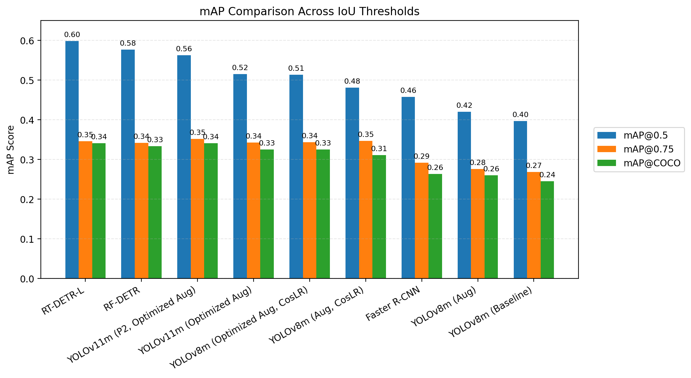
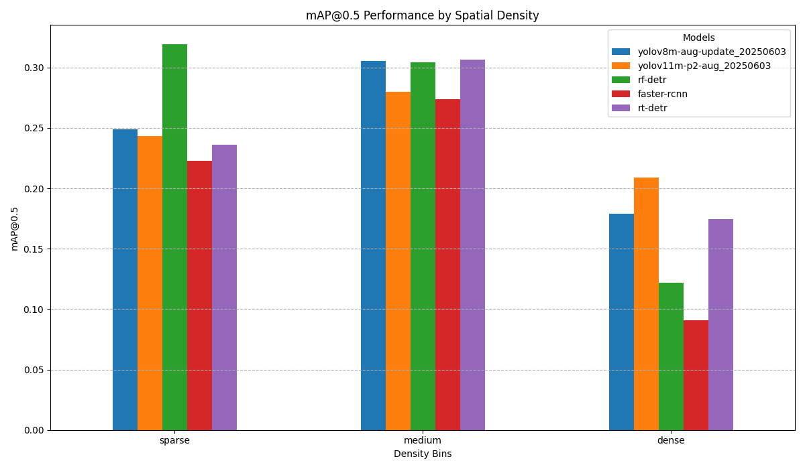
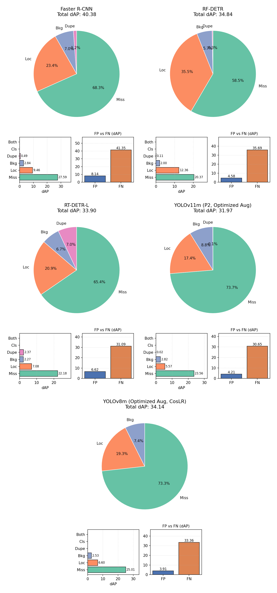

# Small Objects Detection Benchmark

**Benchmark of CNN and DETR-family detectors for small-object detection in aerial imagery.**

---

## TL;DR

- **Scope:** Benchmark of CNN (YOLO, Faster R-CNN) and DETR (RT-DETR, RF-DETR) families for small-object detection in aerial imagery.
- **Dataset:** [SkyFusion](https://www.kaggle.com/datasets/kailaspsudheer/tiny-object-detection) - 2,992 images, 63,530 objects, 3 classes (aircraft, ship, vehicle).
- **Best baseline mAP@0.5:** RT-DETR-L `0.599`.
- **Best tiny-object behavior:** YOLOv11m-P2 (highest tiny-object AP and recall among all models).
- **Post-threshold tuning:** YOLOv11m-P2 reaches `0.693` mAP@0.5 (+23.1% via Optuna).
- **Statistical result:** Aggregate mAP parity vs RT-DETR-L (bootstrap ΔCI crosses zero), but YOLOv11m-P2 has ~+1.9% object-level recall advantage (McNemar, p=2.21e-4).

---

## Problem, Dataset, and Constraints

Detecting small objects (often < 32×32 px) in aerial and satellite imagery is challenging due to low pixel counts, class imbalance, and high object density. This project benchmarks six detector configurations on the **SkyFusion** dataset:

| Statistic | Value |
|---|---|
| Total images | 2,992 |
| Total objects | 63,530 |
| Classes | aircraft, ship, vehicle |
| Image resolution | 640×640 px |
| Avg. object density | 21.25 objects/image |
| Median object density | 7 objects/image |

Vehicles dominate (76.7% of objects), ships are rare (3.4%), and aircraft sit in between (19.9%). Most objects fall into the COCO "small" or "tiny" bins.

---

## What I Built (System + Experiment Pipeline)

1. **Unified benchmark framework** (`src/odc/benchmark/`) — model-agnostic evaluation with pluggable adapters for Ultralytics (YOLO, RT-DETR), RF-DETR, and Faster R-CNN (PyTorch Lightning).
2. **Iterative YOLO training pipeline** — progressive improvements from baseline YOLOv8m through augmentation, cosine LR, optimized augmentation, YOLOv11 upgrade, and P2 head addition.
3. **Threshold optimization** — Optuna-based per-model tuning of `conf_thr` and `nms_iou` on the validation split.
4. **Extended analysis scripts** — size-bin evaluation, spatial-density evaluation, TIDE error decomposition, WBF ensembling, and inference-time tiling.
5. **Statistical significance testing** — paired bootstrap CIs (B=1000) and McNemar's test for object-level recall comparison.

---

## Benchmark Setup (Fair-Comparison Protocol)

| Parameter | Value |
|---|---|
| Test split | 420 images, 6,939 annotations |
| Baseline confidence threshold | 0.25 |
| Baseline NMS IoU | 0.45 (where applicable) |
| Metrics | mAP@0.5, mAP@0.75, mAP@[0.5:0.95], per-class AP, latency/FPS/params |
| Training hardware | Kaggle P100 GPU |
| Inference hardware | NVIDIA GTX 1050 Ti (local) |

All models were evaluated on the identical test split with identical metric computation (COCO-style pycocotools).

---

## Results at a Glance

<p align="center">
  
</p>

| Model | mAP@0.5 | mAP@0.75 | mAP@[0.5:0.95] | Inference (ms) | FPS | Params (M) |
|---|:---:|:---:|:---:|:---:|:---:|:---:|
| **RT-DETR-L** | **0.599** | 0.346 | 0.341 | 86.6 ± 15.5 | 11.5 | 32.0 |
| RF-DETR | 0.577 | 0.342 | 0.334 | 95.0 ± 5.8 | 10.5 | 93.1 |
| YOLOv11m (P2, Optimized Aug) | 0.563 | **0.352** | 0.341 | 61.0 ± 1.1 | 16.4 | 20.5 |
| YOLOv11m (Optimized Aug) | 0.515 | 0.343 | 0.325 | 45.5 ± 1.0 | 22.0 | 20.0 |
| YOLOv8m (Optimized Aug, CosLR) | 0.514 | 0.344 | 0.325 | 43.8 ± 1.4 | 22.8 | 25.8 |
| Faster R-CNN | 0.458 | 0.292 | 0.264 | 200.3 ± 5.9 | 5.0 | 41.3 |

> RT-DETR-L leads on aggregate mAP@0.5; YOLOv11m-P2 is best on mAP@0.75 and tiny-object AP/recall, with 3× fewer parameters than RF-DETR and the fastest DETR-class inference.

---

## Key Improvements and Ablations

### YOLO Training Progression

| Step | Change | mAP@0.5 | Δ | Vehicle AP |
|---|---|:---:|:---:|:---:|
| 1 | Baseline YOLOv8m | 0.397 | — | 0.224 |
| 2 | + Augmentation | 0.420 | +5.8% | 0.291 |
| 3 | + Cosine LR | 0.481 | +14.5% | 0.329 |
| 4 | Optimized Augmentation | 0.514 | +6.9% | 0.412 |
| 5 | YOLOv11m | 0.515 | +0.2% | 0.413 |
| 6 | YOLOv11m + P2 head | **0.563** | **+9.3%** | **0.560** (+35.6% vs step 5) |

### Optuna Threshold Tuning Impact

| Model | Baseline mAP@0.5 | Optimized mAP@0.5 | Improvement |
|---|:---:|:---:|:---:|
| YOLOv11m (P2, Optimized Aug) | 0.563 | **0.693** | **+23.1%** |
| YOLOv8m (Optimized Aug, CosLR) | 0.514 | 0.662 | +28.8% |
| RT-DETR-L | 0.599 | 0.652 | +8.8% |
| RF-DETR | 0.577 | 0.637 | +10.4% |
| Faster R-CNN | 0.458 | 0.493 | +7.6% |

---

## What Did Not Work

- **Class-specific training (dropping aircraft):** Reduced ship and vehicle AP — inter-class context matters.
- **Inference-time tiling:** Regressed performance for both top models (YOLOv11m-P2 −7.0% mAP@0.5; RT-DETR-L −28.2%) due to train-infer scale mismatch.
- **WBF ensemble:** Gave modest overall gain (+0.6% mAP@[0.5:0.95]) but better small-object gain (+2.8% AP_S). Not enough to justify 2× inference cost without further tuning.

---

## Statistical Confidence (Bootstrap + McNemar)

### Paired Bootstrap (B=1000, 95% CI)

| Model | mAP@0.5 [95% CI]; SE | mAP@0.75 [95% CI]; SE | mAP@[0.5:0.95] [95% CI]; SE |
|---|---|---|---|
| RT-DETR-L | 0.609 [0.565, 0.668]; 0.030 | 0.344 [0.328, 0.363]; 0.009 | 0.339 [0.320, 0.365]; 0.013 |
| YOLOv11m (P2, Optimized Aug) | 0.609 [0.565, 0.668]; 0.030 | 0.337 [0.320, 0.356]; 0.010 | 0.344 [0.323, 0.368]; 0.013 |

### Pairwise Δ (RT-DETR-L − YOLOv11m-P2)

- Δ mAP@0.5 = −0.0001 [−0.017, +0.015] → **crosses zero** (no significant aggregate gap)
- Δ mAP@[0.5:0.95] = −0.0040 [−0.015, +0.006] → crosses zero
- Δ mAP@0.75 = +0.0066 [−0.008, +0.021] → crosses zero

### McNemar's Test (Object-Level Recall, IoU=0.5, n=6,939)

| Statistic | Value |
|---|---|
| n₀₁ (RT-DETR-L missed, YOLOv11m-P2 detected) | 675 |
| n₁₀ (RT-DETR-L detected, YOLOv11m-P2 missed) | 545 |
| χ² | 13.64 |
| p-value | 2.21 × 10⁻⁴ |
| Δ detection rate | −0.0187 [−0.0286, −0.0089] |

**Interpretation:** Aggregate mAP is statistically tied; at the object level, YOLOv11m-P2 detects ~1.9% more ground-truth objects — a modest but statistically significant recall advantage.

---

## Reproducibility / How to Run

> **Caveat:** Some research scripts still include path assumptions from thesis-time local environment. The entry points below use configurable CLI arguments.

### 1. Environment Setup

```bash
# Requires Python 3.10–3.11
uv sync
```

### 2. Exploratory Data Analysis

```bash
uv run python src/scripts/dataset_eda.py \
  --dataset datasets/SkyFusion_yolo \
  --output materials/dataset_eda
```

### 3. Run Benchmark

```bash
# Complete benchmark (all models, full test set)
uv run python src/scripts/benchmark.py --mode complete

# Quick sanity check (20 samples, single model)
uv run python src/scripts/benchmark.py --mode simple --samples 20
```

### 4. Size-Bin Analysis

```bash
uv run python src/scripts/size_bin_benchmark.py \
  --dataset_path datasets/SkyFusion_yolo \
  --output_dir output/size-bin
```

### 5. Spatial Density Analysis

```bash
uv run python src/scripts/spatial_density_benchmark.py \
  --dataset_path datasets/SkyFusion_yolo \
  --output_dir output/spatial-density
```

**Prerequisites:** Model weights must be placed in `models/`. See [`models/README.md`](models/README.md) for exact filenames, optimal thresholds, and download links.

---

## Repository Structure

```
small-objects-detection-benchmark/
├── docs/assets/                  # Figures for README
├── models/                       # Trained weights + model zoo README
│   └── README.md                 # Filenames, thresholds, usage examples
├── notebooks_and_scripts/        # Kaggle notebooks, local experiment scripts
│   ├── kaggle/
│   ├── local/
│   └── future_work/
├── src/
│   ├── odc/                      # Core library
│   │   ├── benchmark/            # Pipeline, adapters, metrics, visualizers
│   │   └── dataset_eda/          # EDA pipeline
│   └── scripts/                  # CLI entry points
│       ├── benchmark.py          # Main benchmark (simple/complete/enhanced)
│       ├── dataset_eda.py        # Dataset EDA
│       ├── size_bin_benchmark.py # Size-bin performance analysis
│       ├── spatial_density_benchmark.py
│       ├── generate_density_model_grid.py
│       ├── generate_tide_error_plots.py
│       ├── plot_size_bin_comparison.py
│       ├── count_density_bins.py
│       └── augment_dataset.py
├── pyproject.toml                # Dependencies (uv)
└── uv.lock
```

---

## Artifacts and Links

| Artifact | Link |
|---|---|
| **Trained models** | [Kaggle Models](https://www.kaggle.com/models/jakubszpunar/small-objects-detection-benchmark-models) |
| **SkyFusion dataset** | [Kaggle Dataset](https://www.kaggle.com/datasets/kailaspsudheer/tiny-object-detection) |
| **Code repository** | [GitHub (v1.0.0)](https://github.com/YgLK/small-objects-detection-benchmark/tree/v1.0.0) |

---

## Discussion Points

1. **Why DETR wins rare classes but YOLO wins tiny vehicles:** RF-DETR achieves highest ship AP (0.471) via global attention over the full image, while YOLOv11m-P2's extra high-resolution feature map (P2) preserves fine-grained spatial detail critical for the dominant tiny-vehicle class.
2. **Latency/accuracy/parameter trade-offs:** YOLOv11m-P2 delivers near-DETR accuracy at 61 ms (vs 87–95 ms) with 20.5M params (vs 32–93M). For edge deployment, this matters.
3. **Why threshold optimization materially changed ranking:** Default conf=0.25 penalizes models with different confidence distributions. Optuna tuning on validation shifted YOLOv11m-P2 from 3rd to 1st on mAP@0.5 — showing that "out-of-the-box" rankings can be misleading.
4. **Why failed tiling matters:** Tiling magnifies content by ~1.25×, creating a train-infer scale mismatch. Models trained on 640×640 don't generalize to upscaled 512→640 tiles. This is a practical lesson for production aerial detection pipelines.
5. **Why both aggregate and object-level significance were reported:** Bootstrap Δ-CIs test *ranking stability* of aggregate mAP; McNemar's tests whether the models *detect different objects*. Together they reveal that the models are tied on the metric but not interchangeable per object.
6. **Productionization next steps:** Integrate tiling with tile-aware training, apply Optuna jointly with WBF ensemble weights, deploy with TensorRT/ONNX quantization, and add active-learning feedback for rare-class samples.

---

## Limitations and Future Work

- **Single dataset:** Results are specific to SkyFusion; generalization to other aerial datasets (DOTA, VisDrone) is untested.
- **Fixed input resolution:** All models used 640×640; higher-resolution training could shift rankings.
- **No tile-aware training:** Tiling was only applied at inference; training on tiles may recover the expected gains.
- **Ensemble not fully tuned:** WBF used default thresholds; per-class weighting and expanded model diversity are open.
- **Hardware-specific latency:** Inference times measured on GTX 1050 Ti; relative rankings may differ on other hardware.

---

## Figures

### Object Density Performance Comparison

<p align="center">
  
</p>

### TIDE Error Decomposition

<p align="center">
  
</p>
